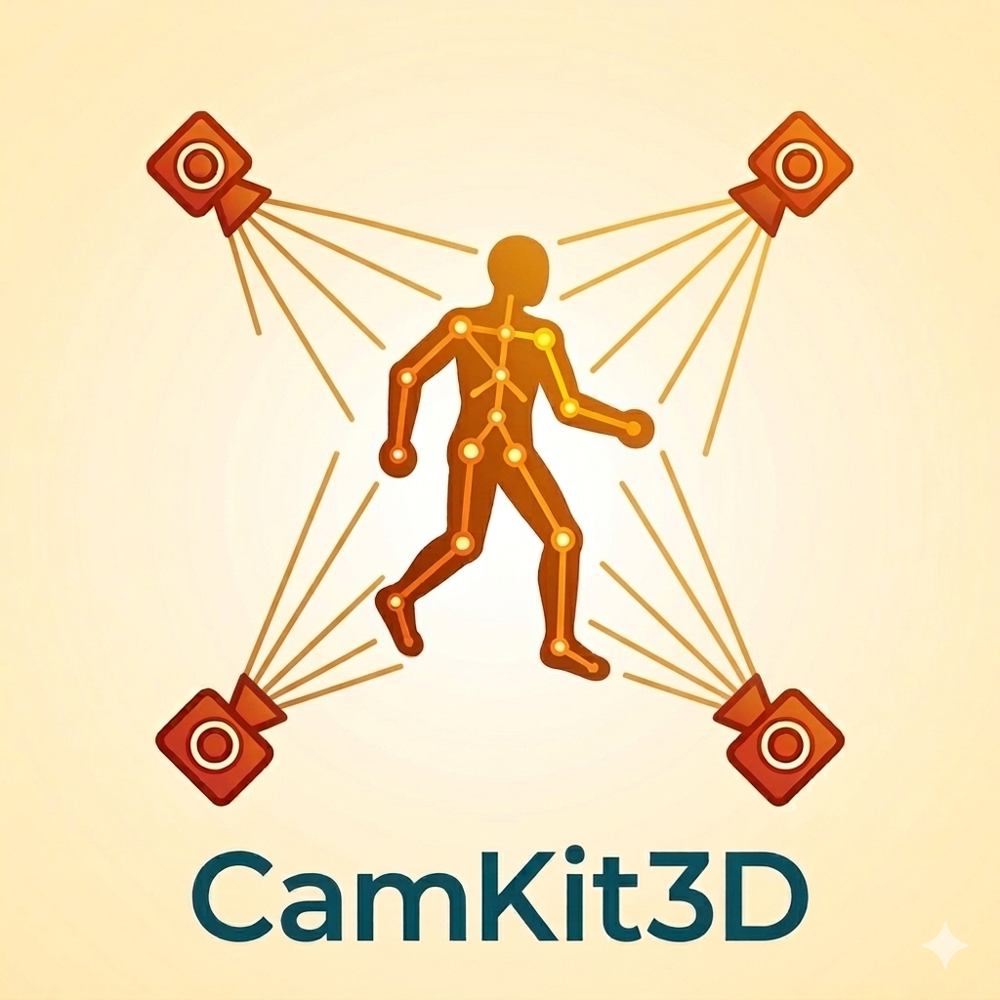

# CamKit3D

<p align="center">
  <a href="https://github.com/neurofractal/camkit3D">
    
  </a>
</p>

**Markerless multi-camera 3D motion capture for naturalistic behavioural and neuroscience research.**

CamKit3D turns a handful of ordinary USB webcams into a markerless motion-capture system. It covers the full path from raw video to analysed 3D skeleton data: recording, temporal synchronisation, 2D pose estimation, triangulation, and analysis and visualisation. No markers, no bodysuits, and no specialist camera hardware are required.

The package can be used stand-alone, or run alongside wearable brain imaging so that movement and neural activity are captured together.

<p align="center">
  
</p>

*The animation above shows a reconstructed 3D skeleton produced by CamKit3D from a multi-camera recording: 2D keypoints detected in each camera view are triangulated into 3D and aligned into a standard anatomical frame for viewing.*

## The pipeline

CamKit3D is organised as five sequential stages. You can run the whole thing end-to-end, or use any stage on its own if your data is laid out correctly.

| Stage | Module | Purpose |
|---|---|---|
| Record | `camkit3d.recorder` | Capture synchronised video from multiple USB webcams |
| Synchronise | `camkit3d.sync` | Align frames across cameras to a common timing grid |
| 2D pose | `camkit3d.pose2d` | Extract body keypoints per frame with MediaPipe Pose |
| 3D pose | `camkit3d.pose3d` | Triangulate 2D keypoints into 3D world coordinates |
| Analyse | `camkit3d.analysis` | Orient, plot, and animate the 3D skeleton data |

Reconstructed poses can also be explored interactively in the browser with `camkit3d.viewer`.

## Installation

```bash
pip install camkit3d
```

Or install from source in editable mode (recommended for development):

```bash
git clone https://github.com/neurofractal/camkit3D
cd camkit3D
pip install -e ".[dev]"
```

**Requirements:** Python ≥ 3.9, USB 3.0 ports for multi-camera recording, and a TOML camera calibration file (compatible with [Anipose](https://anipose.readthedocs.io/) and [FreeMoCap](https://freemocap.org/) workflows).

## Documentation

Full documentation, including hardware notes, the calibration guide, and an end-to-end walkthrough, lives in the [docs](docs/index.md). Start with the [installation guide](docs/installation.md).

## Acknowledgements

- [MediaPipe Pose](https://google.github.io/mediapipe/solutions/pose.html) (Google) for 2D keypoint detection
- [Anipose](https://anipose.readthedocs.io/) for triangulation methodology
- [FreeMoCap](https://freemocap.org/) for calibration format and inspiration

## Citation

Seymour, R. A., Hill, R., Brookes, M. J., & Woolrich, M. W. (in preparation). *Markerless 3D Motion Capture for Wearable OPM-MEG*.

## License

GNU GPL v3.0 — see [LICENSE](https://github.com/neurofractal/camkit3D/blob/main/LICENSE) for details.