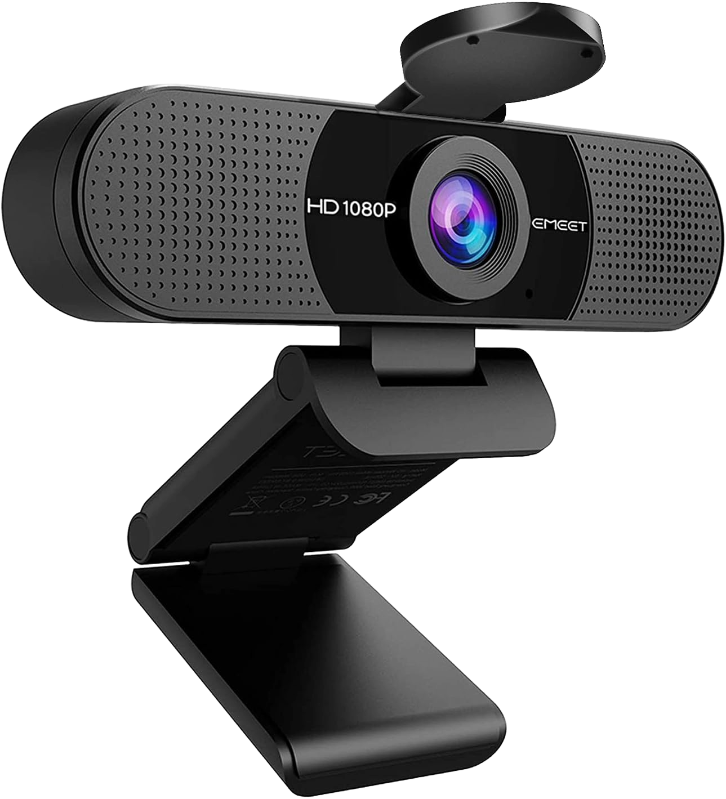

# Hardware

# 3D Motion Capture — Camera Setup and Recording

#### Webcam compatibility

Any standard USB webcam should work with *camKit3D*, provided it can be accessed as a standard camera device by the computer. Higher-resolution and higher-frame-rate cameras can be used if required, although the default settings are optimised for standard webcams.

#### Default camera settings

camKit3D is configured by default for **30 frames per second (FPS)** at **HD 1280 × 720 resolution**. These settings provide a good balance between temporal resolution, spatial resolution, and computational/USB bandwidth.

#### Recommended webcam

I have been using the **EMEET C960 1080P Webcam with Microphone**, which provides a **90° field of view** and supports 1080p video. [EMEET C960 1080P Webcam on Amazon UK](https://www.amazon.co.uk/dp/B07M6Y7355?th=1&utm_source=chatgpt.com)

*EMEET C960 1080P*

#### Camera placement and field of view

For whole-body 3D motion capture, cameras should be positioned so that the participant remains fully within the field of view throughout the recording. A wider field of view can be advantageous for capturing large movements, but cameras should still be positioned close enough to provide sufficient image resolution for reliable pose estimation.

!!! tip "Tips"

    - Multiple cameras require overlapping views of the participant to provide complementary observations of body landmarks. Arranging the webcams in a circular array is often the best way to achieve this.

    - A good [YouTube video on camera placement (and markerless mocap in general)](https://youtu.be/GxKmyKdnTy0?si=CoV965Oi7OyM5Oar&t=788) can be found here.

    - 2D pose estimation, particularly with MediaPipe, can run into issues when keypoints go in and out of frame, especially the face. Try to ensure your participant's movements do not cause keypoints to leave the camera frame.

    - When combining with OPM-MEG, smaller shielded rooms (less than 2 m³) can be an issue when trying to capture the whole body. In even smaller rooms, capturing the face and torso together simultaneously can also be difficult.

#### Simultaneous multi-camera recording

When recording from multiple USB cameras simultaneously, the main hardware bottleneck is often **USB bandwidth rather than CPU/GPU processing**. Each camera continuously transfers video data to the computer, and multiple cameras connected through the same USB hub can compete for the hub's available bandwidth. This can result in dropped frames, reduced frame rates, camera failures, or inconsistent recording if the available bandwidth is exceeded.

#### USB hub considerations

Where possible, distribute cameras across **different USB controllers** rather than connecting several high-bandwidth cameras to a single USB hub. Powered USB hubs can help with the power requirements of multiple cameras, but not always. For larger multi-camera setups, it is important to check which physical USB ports share the same controller.

#### Data rate and compression

The effective USB load depends on the camera's resolution, frame rate, pixel format, and whether the webcam performs hardware video compression. Uncompressed formats such as raw RGB can require substantially more bandwidth than compressed formats such as MJPEG. Reducing resolution or frame rate can substantially reduce USB bandwidth requirements when recording with multiple cameras.

#### Practical recommendation

For a multi-camera setup, start with **1280 × 720 at 30 FPS** and test all cameras simultaneously before data collection. Check that every camera maintains the intended frame rate without dropped frames and that the participant remains fully visible from all viewpoints. If bandwidth becomes a limitation, reduce the camera resolution, frame rate, or distribute cameras across additional USB controllers.