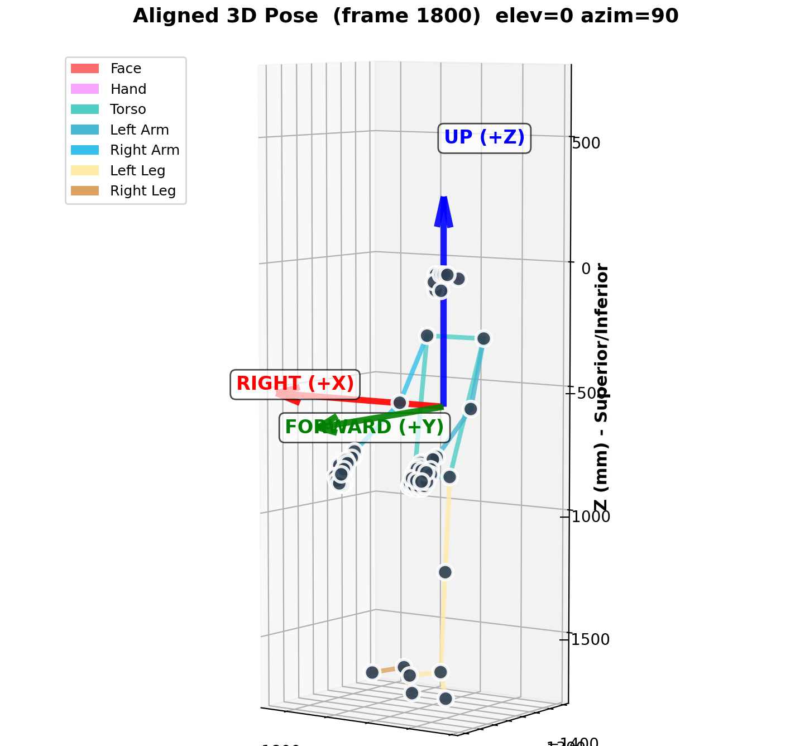
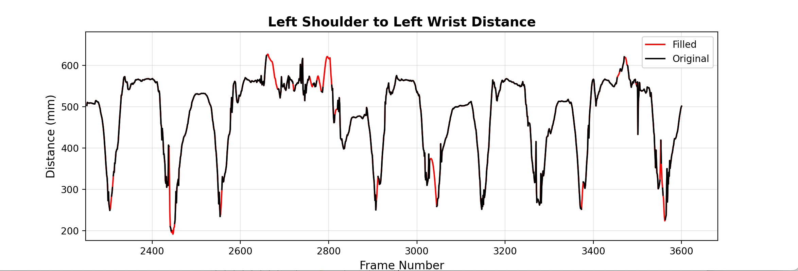
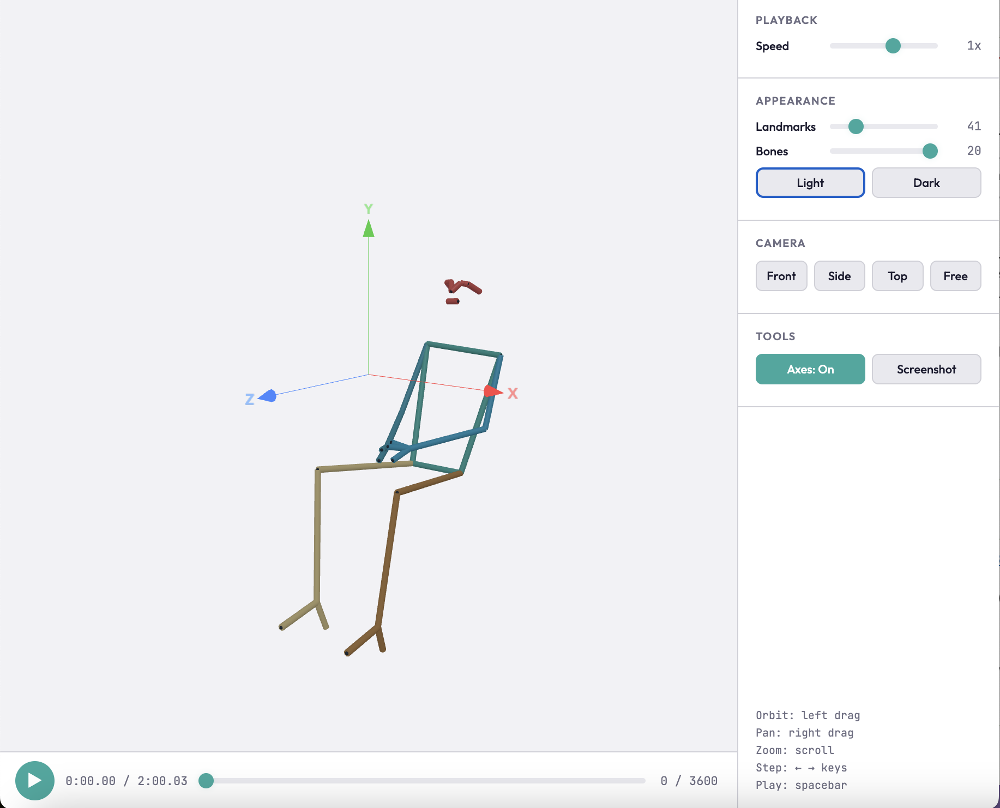
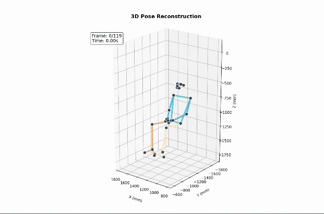

# Stage 5 — Analysis and animation

`camkit3d.analysis`

Tools for inspecting and presenting triangulated 3D pose data (shape `(n_frames, n_keypoints, 3)`, units in mm, missing detections as NaN). The module is skeleton-agnostic: landmark indices are resolved by name from the loaded descriptor, so the same workflow applies to any defined skeleton (e.g. `mediapipe_pose`, `mediapipe_holistic`).

```python
import numpy as np
from camkit3d import skeletons
from camkit3d.analysis import (
    detect_person_orientation,
    align_pose_to_standard_frame,
    plot_aligned_skeleton,
    interpolate_nans,
    animate_3d_pose,
)
from camkit3d.viewer import viewer

points_3d = np.load("data_3d/pose_3d.npy")
pose = skeletons.load()  # mediapipe_pose by default
```

## Detect, align and plot orientation

`detect_person_orientation(points_3d)` derives a body-centred coordinate frame from the pose landmarks, so a recording can be re-expressed in upright, person-facing, floor-referenced coordinates independent of camera placement. **Up** runs from the hip midpoint to the shoulder midpoint (torso long axis), **forward** points out of the chest toward the nose, and **right** is the orthogonal third axis. The floor is estimated as the 5th percentile of ankle heights projected onto the up-axis. The function returns the three orthogonal axes, a `rotation_matrix` mapping world to anatomical frame, and `ground_plane_z`. Estimates are averaged across sampled frames for robustness.

```python
orientation = detect_person_orientation(points_3d, skeleton="mediapipe_pose")
```

`align_pose_to_standard_frame(points_3d)` applies the detected rotation so that X is medial-lateral, Y is anterior-posterior, and Z is superior-inferior. Orientation is auto-detected if not supplied. NaNs are preserved through the rotation. This standardises the frame so that downstream plots and viewpoints are consistent regardless of original camera geometry.

```python
points_3d_aligned, R, orient = align_pose_to_standard_frame(points_3d)
```

`plot_aligned_skeleton(...)` renders a single frame of the aligned skeleton with bones coloured by anatomical group and labelled anatomical axes. It is used to confirm visually that alignment succeeded before producing video output. Viewing angle is set with `elev` and `azim`.

```python
plot_aligned_skeleton(points_3d_aligned, elev=0, azim=90)
```


## Interpolate missing data

`interpolate_nans(...)` fills short tracking dropouts. Each landmark coordinate is treated as an independent signal; only bounded gaps (valid data on both sides) up to `max_gap_seconds` are filled, while leading, trailing, and over-long gaps are left as NaN. This avoids fabricating data across long occlusions. The function returns the filled array and a `report` dict summarising gaps filled and skipped.

Key arguments:

- **`method`** — `"pchip"` (smooth, shape-preserving, no overshoot; recommended default for mocap), `"linear"` (fast but produces kinks at gap boundaries), or `"savgol"` (linear fill followed by Savitzky-Golay smoothing, for noisy data).
- **`max_gap_seconds`** — maximum gap duration to fill; longer gaps stay NaN.
- **`fps`** — frame rate, used to convert `max_gap_seconds` into frames.
- **`savgol_window`**, **`savgol_polyorder`** — Savitzky-Golay filter settings (used only when `method="savgol"`).
- **`verbose`** — print a summary of values and gaps filled or skipped.

```python
points_3d_filled, report = interpolate_nans(
    points_3d_aligned, method="pchip", max_gap_seconds=1.0, fps=30
)
```



## Interactive viewers

Two interactive viewers are available for exploratory inspection.

**Browser viewer.** from `camkit3d.viewer`. Written in html.

```python
from camkit3d.viewer import viewer
viewer(points_3d_filled, fps=30, output_path="pose_viewer.html")
```


**Matplotlib viewer.** `interactive_pose_viewer(...)` from `camkit3d.analysis`.

```python
from camkit3d.analysis import interactive_pose_viewer
%matplotlib qt
interactive_pose_viewer(points_3d_filled, fps=30, initial_view="front")
```

## Animate to video

`animate_3d_pose(...)` exports the skeleton as a real-time video via FFmpeg, using the matplotlib viewer from above. The camera can be fixed or rotating. Overlays (floor, axes, frame number, timestamp) and output quality (DPI and bitrate presets) are configurable.

```python
animate_3d_pose(
    points_3d_filled,
    output_path="animations/pose_front.mp4",
    view_mode="custom",
    elevation=20, azimuth_start=128, rotation_speed=0,
    show_floor=False, show_axes=True,
    keypoint_size=70, line_width=4,
    fps=30, quality="high",
)
```

