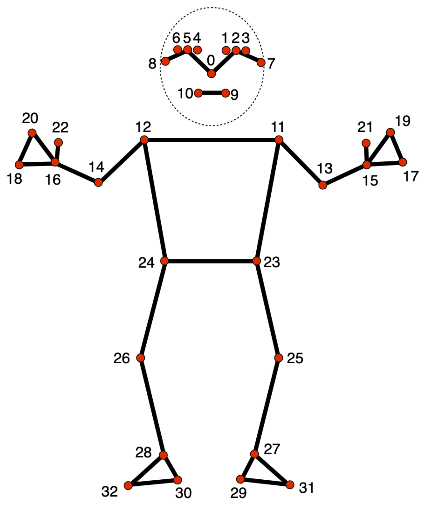

# Skeletons

CamKit3D defaults to the **MediaPipe Pose** skeleton (BlazePose, 33 landmarks,
MediaPipe 0.10.21). However the package is **skeleton-agnostic** by design: 
nothing in the 2D detection, 3D triangulation,
viewer, or analysis code hard-codes which landmarks exist or how they connect.
Instead, every pipeline reads a *skeleton descriptor* — a small YAML file that
defines the landmarks, how they group into body parts, how they connect into a
drawable skeleton, and a few reference points used for orientation and quality
control.


This means you can swap MediaPipe Pose for any other pose estimator you wish.

---

## What is a skeleton?

A skeleton is a **named set of landmarks plus the relationships between them**.

- **What are the points?** An ordered list of landmarks, each with an index, a
   name, the body part it belongs to, and its left/right/center side.
- **How do they group?** Named sets of landmarks (`face`, `torso`,
   `left_hand`, …) used for colouring and per-part confidence thresholds.
- **How do they connect?** Pairs of landmarks joined by a "bone" when the
   skeleton is drawn.
- **Where are the reference points?** Anatomical anchors (hips, shoulders,
   nose) that orientation and alignment code uses to work out which way the
   body is facing.

The landmark **index** must be consistent with your data:
index `N` in the descriptor is column `N` in your `(n_frames, n_landmarks, 3)`
keypoint array.

---

## Loading a skeleton

Skeletons are loaded by **id**, which is the filename stem of the descriptor
(`mediapipe_pose.yaml` → `"mediapipe_pose"`):

```python
from camkit3d import skeletons

pose = skeletons.load("mediapipe_pose")     # load by id
pose = skeletons.load()                      # default skeleton (mediapipe_pose)

skeletons.available()                        # ['mediapipe_holistic', 'mediapipe_pose']
```

Loads are cached, so calling `load()` repeatedly is free and returns the same
object. Passing an unknown id raises a `FileNotFoundError` that lists what *is*
available.

Once loaded, a skeleton provides everything the pipelines need:

```python
pose.num_landmarks            # 33
pose.names                    # ['nose', 'left_eye_inner', ...]
pose.index_of("left_wrist")   # 15  — look up an index by name

pose.group_indices("face")    # (0, 1, 2, ... 10)  — one named group
pose.face_indices             # [0..10]   — role-resolved (see "Roles")
pose.hand_indices             # [17..22]
pose.body_indices             # everything that isn't face or hand

pose.anchor("left_hip")       # 23  — anatomical reference point
pose.has_anchors("left_hip", "right_hip")   # True

pose.edges                    # [(0, 1), (1, 2), ...]  — skeleton connections
pose.edge_colors              # ['#FF6B6B', ...]       — colour per edge
pose.confidence_thresholds()  # per-landmark threshold array, shape (33,)
```

The pipelines accept a skeleton wherever relevant:

```python
from camkit3d.pose3d import Pose3DProjector

projector = Pose3DProjector(
    calibration_path=calib,
    keypoints_dir=kp_dir,
    skeleton="mediapipe_holistic",   # id string or a loaded PoseDefinition
)
```

---

## Anatomy of a descriptor

A descriptor is a YAML file with the sections below. Only `metadata`,
`landmarks`, `groups`, and `connections` are required; the rest are optional. The canonical examples are
[`mediapipe_pose.yaml`](#example-mediapipe-pose-33-landmarks)
and [`mediapipe_holistic.yaml`](#example-mediapipe-holistic-543-landmarks).

## Validation

`skeletons.load()` validates a descriptor on load and raises a `ValueError`
describing the first problem it finds. The checks:

* `num_landmarks` matches the number of landmark rows.
* Landmark indices are contiguous `0 .. n-1`.
* Every group index references a real landmark.
* Every connection references real landmarks and a known group.
* Symmetry pairs and anatomy anchors are in range.

If validation fails, fix the descriptor — the pipelines will not accept an invalid
skeleton.

---

## Writing a new skeleton

1. Create `src/camkit3d/skeletons/data/<your_id>.yaml`.
2. Fill in `metadata` (with `skeleton_id: <your_id>` matching the filename),
   `landmarks`, `groups`, and `connections`. Add `anatomy` if you want
   orientation/alignment to work, and `roles` if your hand/face groups aren't
   named `hand`/`face`.
3. Load it: `skeletons.load("<your_id>")`. Fix any validation errors.
4. Use it: pass `skeleton="<your_id>"` to the pipelines.

## Example: MediaPipe Pose (33 landmarks)

The baseline skeleton: a single person's body, 33 landmarks, with a real
per-point visibility score.

* `face` — 11 head points (0–10)
* `torso`, `left_arm`/`right_arm`, `left_leg`/`right_leg` — body parts
* `hand` — 6 coarse hand points (17–22): pinky, index, thumb per side
* anchors for hips, shoulders, nose, ankles

```python
pose = skeletons.load("mediapipe_pose")
pose.num_landmarks      # 33
pose.anchor("left_hip") # 23
```



## Example: MediaPipe Holistic (543 landmarks)

The combined skeleton: body + dense face mesh + detailed hands, concatenated
into one index space.

| Block      | Indices   | Count | Notes                                  |
|------------|-----------|-------|----------------------------------------|
| pose       | 0 – 32    | 33    | identical to `mediapipe_pose`          |
| face       | 33 – 500  | 468   | dense face mesh                        |
| left hand  | 501 – 521 | 21    | full finger articulation               |
| right hand | 522 – 542 | 21    | full finger articulation               |

Two things to note:

* **Face/hand confidence is presence, not quality** (see the note under
  `groups`). The 468 face points especially do not triangulate well across
  cameras — they are designed for a single frontal view — so for 3D work you
  typically capture with face disabled and rely on pose + hands.

```python
h = skeletons.load("mediapipe_holistic")
h.num_landmarks    # 543
h.hand_indices     # [501..542]  — both hands, role-resolved
h.body_indices     # the 33 pose points
```

---

## Quick reference

| Method / property            | Returns                                        |
|------------------------------|------------------------------------------------|
| `load(id="mediapipe_pose")`  | a validated `PoseDefinition` (cached)          |
| `available()`                | sorted list of skeleton ids                    |
| `.num_landmarks`             | landmark count                                 |
| `.names`                     | landmark names, ordered by index               |
| `.index_of(name)`            | index for a landmark name                      |
| `.group_indices(group)`      | indices in a named group                       |
| `.face_indices` / `.hand_indices` / `.body_indices` | role-resolved index lists   |
| `.anchor(role)`              | index for an anatomical role                   |
| `.has_anchors(*roles)`       | whether all given roles are defined            |
| `.edges`                     | list of `(start, end)` connections             |
| `.edge_colors`               | hex colour per edge                            |
| `.confidence_thresholds()`   | per-landmark threshold array                   |
